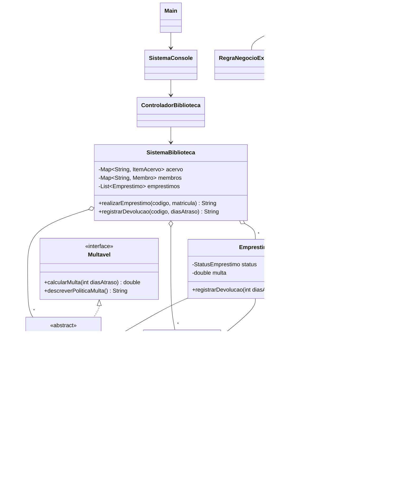

```mermaid
classDiagram
    direction TB

    class Main
    class SistemaConsole
    class ControladorBiblioteca
    class SistemaBiblioteca {
        -Map~String, ItemAcervo~ acervo
        -Map~String, Membro~ membros
        -List~Emprestimo~ emprestimos
        +realizarEmprestimo(codigo, matricula) String
        +registrarDevolucao(codigo, diasAtraso) String
    }

    class Multavel {
        <<interface>>
        +calcularMulta(int diasAtraso) double
        +descreverPoliticaMulta() String
    }

    class ItemAcervo {
        <<abstract>>
        -String codigo
        -String titulo
        -boolean disponivel
        +emprestar()
        +devolver()
        +getTipo()* String
        +getPrazoDias()* int
    }

    class Livro {
        -String autor
        +calcularMulta(int) double
    }

    class Revista {
        -int edicao
        +calcularMulta(int) double
    }

    class Membro {
        -String matricula
        -String nome
        -int emprestimosAtivos
        +registrarEmprestimo()
        +registrarDevolucao()
    }

    class Emprestimo {
        -StatusEmprestimo status
        -double multa
        +registrarDevolucao(int diasAtraso) double
    }

    class StatusEmprestimo {
        <<enumeration>>
        ATIVO
        DEVOLVIDO
    }

    class RegraNegocioException
    class EntidadeNaoEncontradaException

    Main --> SistemaConsole
    SistemaConsole --> ControladorBiblioteca
    ControladorBiblioteca --> SistemaBiblioteca

    SistemaBiblioteca o-- "*" ItemAcervo
    SistemaBiblioteca o-- "*" Membro
    SistemaBiblioteca o-- "*" Emprestimo

    Multavel <|.. ItemAcervo
    ItemAcervo <|-- Livro
    ItemAcervo <|-- Revista

    Emprestimo --> ItemAcervo
    Emprestimo --> Membro
    Emprestimo --> StatusEmprestimo

    Exception <|-- RegraNegocioException
    Exception <|-- EntidadeNaoEncontradaException
```
